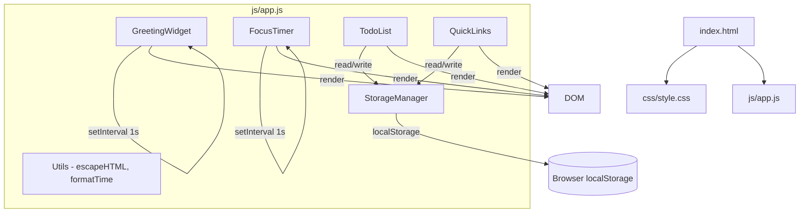
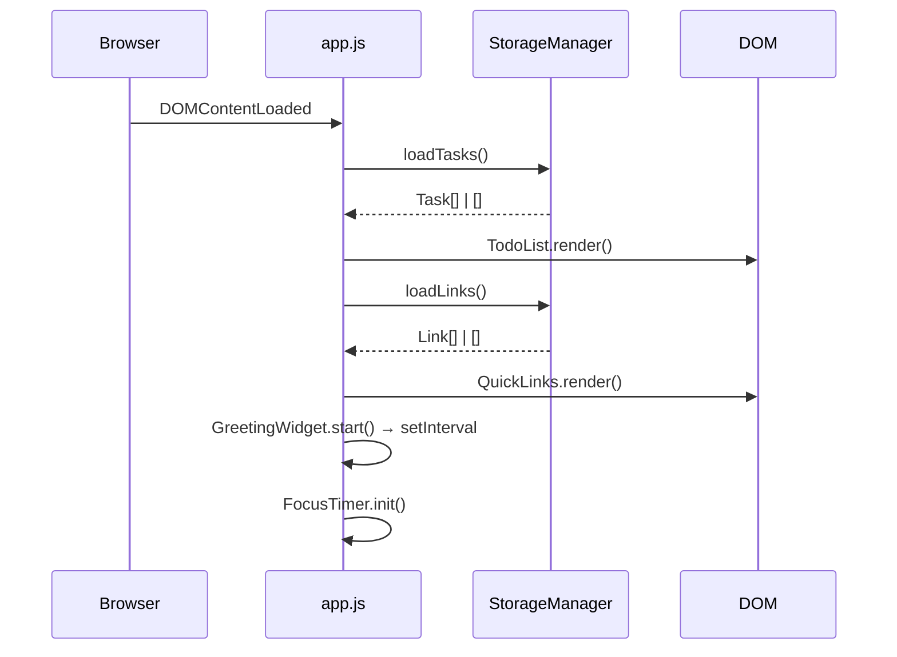

# Design Document — Simple Web Dashboard

## Overview

Simple Web Dashboard adalah aplikasi web mandiri (standalone) yang berjalan sepenuhnya di browser tanpa backend server. Tidak ada proses build, tidak ada framework JavaScript, dan tidak ada dependensi eksternal — hanya satu file `index.html`, satu file `css/style.css`, dan satu file `js/app.js`.

Empat widget utama dikelola dalam satu file JavaScript monolitik yang terstruktur menggunakan modul IIFE (Immediately Invoked Function Expression) dan pola namespace objek, sehingga state tetap terisolasi tanpa polusi global scope. Semua persistensi data dilakukan melalui lapisan abstraksi `StorageManager` yang membungkus `localStorage`.

Tujuan desain utama:
- **Kesederhanaan**: Tidak ada transpiler, bundler, atau build step. Buka di browser, langsung jalan.
- **Keterbacaan**: Setiap komponen memiliki namespace sendiri (`GreetingWidget`, `FocusTimer`, `TodoList`, `QuickLinks`, `StorageManager`).
- **Keandalan**: Semua operasi localStorage dibungkus try/catch; data korup tidak menyebabkan crash.
- **Keamanan**: Semua teks yang dirender ke DOM melewati `escapeHTML()` untuk mencegah XSS.

---

## Architecture

Aplikasi menggunakan arsitektur **modular monolith** — satu file JS dengan namespace terpisah per komponen. Tidak ada dependency antar modul yang melingkar; aliran data searah: komponen baca/tulis state → panggil `StorageManager` → perbarui DOM.



### Initialization Flow



---

## Components and Interfaces

### Utils

Fungsi-fungsi murni (pure functions) tanpa side effects, dapat diuji secara terisolasi.

```js
// Sanitasi string untuk mencegah XSS sebelum dirender ke innerHTML
function escapeHTML(str: string): string

// Format detik ke string MM:SS dengan zero-padding
function formatTime(totalSeconds: number): string  // e.g. 90 → "01:30"

// Tentukan salam berdasarkan jam
function getGreeting(hour: number): string  // → "Selamat Pagi" | "Selamat Siang" | "Selamat Malam"

// Validasi URL: harus diawali "http://" atau "https://"
function isValidURL(url: string): boolean

// Pad angka ke dua digit
function zeroPad(n: number): string  // e.g. 5 → "05"
```

### StorageManager

Lapisan abstraksi atas `localStorage`. Semua metode mengembalikan objek hasil `{success, data, error}`.

```js
const StorageManager = {
  // Kunci localStorage
  KEYS: {
    TASKS: 'swd_tasks',
    LINKS: 'swd_links',
  },

  // Simpan data. Kembalikan {success: true} atau {success: false, error: string}
  save(key: string, data: any): {success: boolean, error?: string}

  // Muat data. Kembalikan {success: true, data: any} atau {success: false, error: string, data: null}
  load(key: string): {success: boolean, data: any, error?: string}
}
```

**Error cases yang ditangani:**
- `JSON.parse` gagal (data korup) → kembalikan `{success: false, error: '...'}`
- `localStorage.setItem` melempar `QuotaExceededError` → kembalikan `{success: false, error: '...'}`
- `localStorage` tidak tersedia (misal, private browsing ekstrem) → kembalikan `{success: false, error: '...'}`

### GreetingWidget

```js
const GreetingWidget = {
  // Elemen DOM yang ditarget
  elements: { clock, date, greeting },

  // Mulai interval 1000ms, langsung update sekali
  start(): void,

  // Update semua elemen berdasarkan Date.now()
  update(): void,

  // Hentikan interval (untuk cleanup jika dibutuhkan)
  stop(): void,

  _intervalId: number | null,
}
```

### FocusTimer

```js
const FocusTimer = {
  DURATION: 25 * 60,  // 1500 detik

  state: {
    remaining: number,   // detik tersisa
    running: boolean,
  },

  elements: { display, btnStart, btnStop, btnReset, notification },

  // Inisialisasi: set remaining = DURATION, render, bind events
  init(): void,

  // Mulai countdown
  start(): void,

  // Hentikan countdown (pertahankan remaining)
  stop(): void,

  // Reset ke DURATION, sembunyikan notifikasi
  reset(): void,

  // Dipanggil setiap tick — decrement remaining, check completion
  _tick(): void,

  // Perbarui tampilan dan state tombol
  _render(): void,

  _intervalId: number | null,
}
```

### TodoList

```js
const TodoList = {
  tasks: Task[],    // in-memory state

  elements: { input, btnAdd, list },

  // Muat dari storage, render
  init(): void,

  // Tambah task baru (validasi input dulu)
  addTask(text: string): void,

  // Toggle done status
  toggleTask(id: string): void,

  // Masuk mode edit inline untuk task tertentu
  startEdit(id: string): void,

  // Simpan hasil edit (validasi dulu)
  saveEdit(id: string, newText: string): void,

  // Batalkan edit
  cancelEdit(id: string): void,

  // Tampilkan confirm, hapus jika dikonfirmasi
  deleteTask(id: string): void,

  // Render ulang seluruh list ke DOM
  render(): void,

  // Simpan tasks ke StorageManager
  _persist(): void,
}
```

### QuickLinks

```js
const QuickLinks = {
  links: Link[],    // in-memory state

  elements: { inputLabel, inputURL, btnSave, list, errorLabel, errorURL },

  // Muat dari storage, render
  init(): void,

  // Validasi + tambah link
  addLink(label: string, url: string): void,

  // Hapus link
  deleteLink(id: string): void,

  // Render ulang seluruh list ke DOM
  render(): void,

  // Simpan links ke StorageManager
  _persist(): void,
}
```

---

## Data Models

### Task

```js
{
  id: string,          // crypto.randomUUID() atau Date.now().toString()
  text: string,        // teks tugas (sudah di-trim)
  done: boolean,       // status selesai
  createdAt: number,   // Unix timestamp (ms)
}
```

### Link

```js
{
  id: string,          // crypto.randomUUID() atau Date.now().toString()
  label: string,       // label tampilan (sudah di-trim)
  url: string,         // URL lengkap (diawali http:// atau https://)
}
```

### StorageResult

```js
// Return type dari semua operasi StorageManager
{
  success: boolean,
  data?: any,       // hanya pada load() yang berhasil
  error?: string,   // hanya pada operasi yang gagal
}
```

### FocusTimerState

```js
{
  remaining: number,   // detik tersisa (0–1500)
  running: boolean,    // apakah countdown sedang aktif
}
```

---

## Correctness Properties

*A property is a characteristic or behavior that should hold true across all valid executions of a system — essentially, a formal statement about what the system should do. Properties serve as the bridge between human-readable specifications and machine-verifiable correctness guarantees.*

### Property 1: formatTime round-trip encoding

*For any* integer `s` dalam rentang 0–1500, `formatTime(s)` SHALL menghasilkan string berformat "MM:SS" di mana `parseInt(MM) * 60 + parseInt(SS) === s`.

**Validates: Requirements 2.10**

### Property 2: Whitespace tasks ditolak

*For any* string yang tersusun seluruhnya dari karakter whitespace (spasi, tab, newline), `TodoList.addTask()` SHALL menolak input tersebut dan tidak mengubah panjang `tasks` array.

**Validates: Requirements 3.4**

### Property 3: Task addition round-trip ke localStorage

*For any* teks task yang valid (minimal satu karakter non-spasi), setelah `TodoList.addTask(text)` dipanggil, data yang tersimpan di `localStorage` harus mengandung task dengan teks yang sama (setelah di-trim).

**Validates: Requirements 8.1**

### Property 4: Task toggle adalah involusi

*For any* task dengan status `done`, memanggil `toggleTask(id)` dua kali berturut-turut SHALL mengembalikan status `done` ke nilai semula.

**Validates: Requirements 6.1**

### Property 5: escapeHTML mencegah injeksi tag HTML

*For any* string yang mengandung karakter `<`, `>`, `&`, `"`, atau `'`, `escapeHTML(str)` SHALL menghasilkan output yang tidak mengandung tag HTML mentah — karakter tersebut di-escape menjadi entitas HTML.

**Validates: Requirements 4.4, 10.6**

### Property 6: URL validation rejects non-http(s) inputs

*For any* string yang tidak diawali dengan `"http://"` atau `"https://"`, `isValidURL(str)` SHALL mengembalikan `false`.

**Validates: Requirements 9.3**

### Property 7: StorageManager save/load round-trip

*For any* array JavaScript yang valid (Task[] atau Link[]), memanggil `StorageManager.save(key, data)` diikuti `StorageManager.load(key)` SHALL menghasilkan array yang secara deep-equal sama dengan data aslinya.

**Validates: Requirements 8.1, 11.1**

### Property 8: getGreeting konsisten dengan rentang waktu

*For any* jam `h` dalam rentang 0–23:
- Jika `0 ≤ h ≤ 11` → `getGreeting(h) === "Selamat Pagi"`
- Jika `12 ≤ h ≤ 17` → `getGreeting(h) === "Selamat Siang"`
- Jika `18 ≤ h ≤ 23` → `getGreeting(h) === "Selamat Malam"`

**Validates: Requirements 1.3, 1.4, 1.5**

### Property 9: FocusTimer countdown adalah fungsi monoton menurun

*For any* urutan tick yang valid, nilai `remaining` setelah N tick SHALL sama dengan `remaining_awal - N`, tidak pernah bertambah, dan tidak pernah turun di bawah 0.

**Validates: Requirements 2.2, 2.7**

---

## Error Handling

| Situasi | Komponen | Perilaku |
|---|---|---|
| `localStorage` tidak tersedia | StorageManager | Kembalikan `{success: false, error: 'Storage tidak tersedia'}` |
| Data korup (JSON parse error) | StorageManager | Kembalikan `{success: false, error: '...'}`, komponen inisialisasi array kosong + tampilkan pesan error |
| Quota storage penuh | StorageManager | Tangkap `QuotaExceededError`, kembalikan `{success: false, error: 'Storage penuh'}` |
| Input task kosong/whitespace | TodoList | Tidak tambah task, tidak kosongkan input |
| Input edit kosong/whitespace | TodoList | Batalkan edit, tampilkan teks asli |
| Label Quick Link kosong | QuickLinks | Tampilkan pesan error di bawah input label |
| URL tidak valid | QuickLinks | Tampilkan pesan error di bawah input URL |
| Timer sudah berjalan, Start ditekan | FocusTimer | Tombol Start dinonaktifkan — event tidak bisa terpicu |

**Prinsip umum:**
- Tidak ada `alert()` untuk error sistemik — error ditampilkan inline di dekat elemen yang relevan.
- Data korup dari localStorage tidak menyebabkan crash — selalu fallback ke array kosong.
- Setiap operasi `_persist()` memeriksa `StorageResult.success`; jika gagal, tampilkan pesan error non-blocking.

---

## Testing Strategy

### Pendekatan Dual Testing

Karena proyek ini adalah Vanilla JS tanpa build tools, testing dilakukan menggunakan:

- **Unit tests (property-based & example-based)**: Library rekomendasi **[fast-check](https://github.com/dubzzz/fast-check)** (dapat di-load via CDN untuk testing manual, atau via Node.js + `<script type="module">` untuk test runner).
- **Manual integration tests**: Verifikasi perilaku akhir di browser nyata (Chrome, Firefox, Edge, Safari).

### Fungsi yang Layak di-Unit Test (Pure Functions)

Fungsi-fungsi berikut adalah pure functions tanpa side effects, ideal untuk property-based testing:

| Fungsi | Jenis Test |
|---|---|
| `escapeHTML(str)` | Property-based |
| `formatTime(seconds)` | Property-based |
| `getGreeting(hour)` | Property-based |
| `isValidURL(url)` | Property-based |
| `StorageManager.save/load` | Property-based (round-trip) |
| `TodoList.addTask` (logic layer) | Property-based |
| `FocusTimer._tick` (countdown logic) | Property-based |

### Property Test Configuration

- Minimum **100 iterasi** per property test.
- Setiap test diberi tag komentar: `// Feature: simple-web-dashboard, Property N: <deskripsi>`
- Gunakan `fc.integer`, `fc.string`, `fc.array`, `fc.record` dari fast-check sebagai generator.

### Unit Test — Contoh Spesifik (Example-Based)

- `formatTime(0)` → `"00:00"`
- `formatTime(1500)` → `"25:00"`
- `formatTime(90)` → `"01:30"`
- `getGreeting(0)` → `"Selamat Pagi"`, `getGreeting(12)` → `"Selamat Siang"`, `getGreeting(18)` → `"Selamat Malam"`
- `escapeHTML('<script>')` → `"&lt;script&gt;"`
- `isValidURL('https://google.com')` → `true`, `isValidURL('ftp://x')` → `false`
- StorageManager dengan data korup → fallback ke array kosong
- Timer reset mengembalikan remaining ke 1500

### Integration Tests (Manual, di Browser)

1. **GreetingWidget**: Verifikasi jam berubah setiap detik, salam berubah saat jam melewati 12:00 dan 18:00.
2. **FocusTimer**: Start → tunggu 3 detik → Stop → verifikasi remaining = 1497; Reset → verifikasi 1500.
3. **TodoList CRUD**: Tambah task → refresh halaman → verifikasi task masih ada di DOM.
4. **QuickLinks**: Tambah link → klik label → verifikasi tab baru terbuka ke URL yang benar.
5. **XSS**: Input task `` → verifikasi tidak ada dialog alert yang muncul.
6. **Responsive Layout**: Perkecil viewport < 1024px → verifikasi layout berubah ke satu kolom.
7. **Browser Compatibility**: Jalankan langkah di atas di Chrome, Firefox, Edge, Safari.

### Aksesibilitas

- Semua tombol menggunakan elemen `<button>` natif (bukan `<div>` yang di-klik).
- Input memiliki atribut `aria-label` atau `<label>` yang terhubung via `for`/`id`.
- Checkbox menggunakan `<input type="checkbox">` natif.
- Warna tidak menjadi satu-satunya pembawa informasi (status selesai task ditunjukkan dengan strikethrough + warna).
